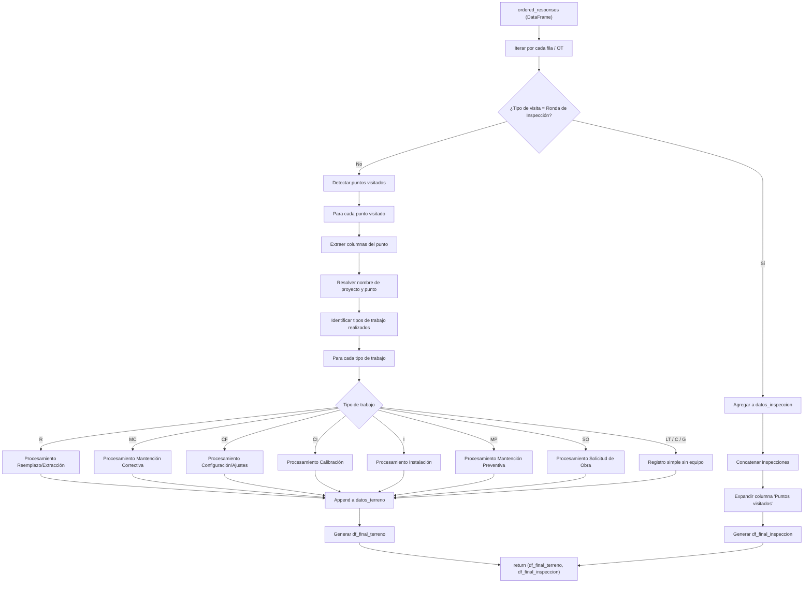
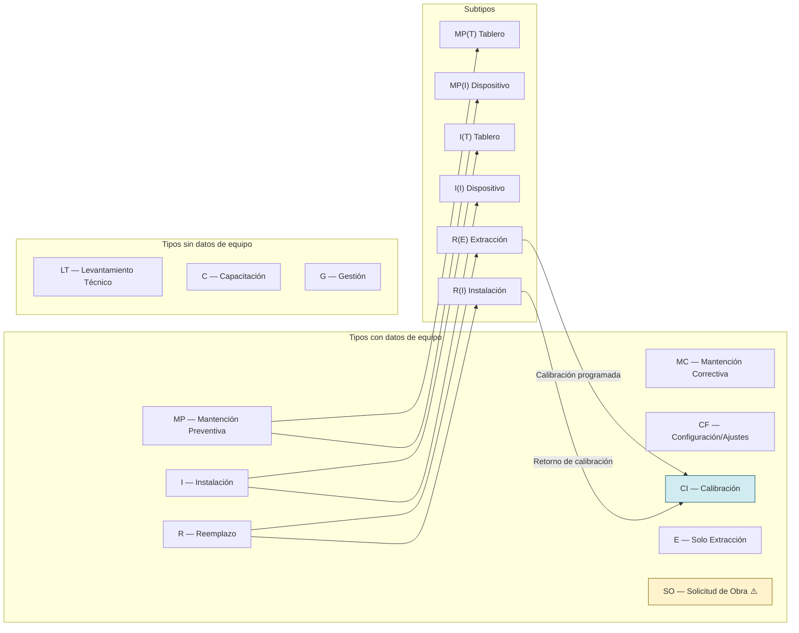

# Documentación Técnica — `processor.py`

> **Módulo**: `trabajos_terreno/processor.py`
> **Última actualización**: Mayo 2026

---

## 1. Propósito General

`processor.py` contiene la función principal `process_entrys`, encargada de transformar los registros crudos provenientes de formularios Connecteam en dos DataFrames estructurados:

| Salida                  | Descripción                                                                                  |
| ----------------------- | --------------------------------------------------------------------------------------------- |
| `df_final_terreno`    | Registros normalizados de trabajos de terreno (mantenciones, instalaciones, reemplazos, etc.) |
| `df_final_inspeccion` | Registros de rondas de inspección diarias, expandidos por punto visitado                     |

La función actúa como el **núcleo de normalización** del pipeline: recibe una tabla de respuestas crudas con columnas dinámicas y la descompone en registros atómicos a nivel de *equipo por punto de monitoreo por tipo de trabajo*.

---

## 2. Firma de la Función

```python
def process_entrys(ordered_responses: pd.DataFrame, API_key_c: str) -> tuple[pd.DataFrame, pd.DataFrame]
```

### Parámetros

| Parámetro            | Tipo             | Descripción                                                                                                           |
| --------------------- | ---------------- | ---------------------------------------------------------------------------------------------------------------------- |
| `ordered_responses` | `pd.DataFrame` | DataFrame con las respuestas del formulario Connecteam, ya ordenadas. Cada fila es una Orden de Trabajo (OT) completa. |
| `API_key_c`         | `str`          | API Key de Connecteam, utilizada para resolver el ID de usuario a nombre legible.                                      |

### Retorno

```python
(df_final_terreno, df_final_inspeccion)
```

---

## 3. Flujo de Procesamiento 



---

## 4. Fase 1 — Preparación de Cada OT (Líneas 11–46)

Para cada fila del DataFrame de entrada:

### 4.1 Limpieza de NaN

```python
r_clean = r.dropna()
df = r_clean.to_frame().T
```

Se eliminan todas las columnas con valor nulo para esa fila. Esto es **fundamental** porque el formulario Connecteam genera columnas dinámicas: una OT con 2 puntos visitados tendrá columnas `1.*` y `2.*`, mientras que una con 3 puntos tendrá también `3.*`. Al eliminar NaN, solo quedan las columnas relevantes para esa OT específica.

### 4.2 Resolución de Usuario

```python
user_name = user(API_key_c, df.iloc[0, index_user])
```

Se consulta la API de Connecteam para convertir el ID numérico del usuario en su nombre completo. Si la API falla, se asigna `"Usuario no encontrado"`.

### 4.3 Bifurcación: Inspección vs. Trabajo

```python
if df['Tipo de visita realizada'].item() == '(R) Ronda diaria de Inspección':
    datos_inspeccion.append(df)
    continue
```

Las rondas de inspección se almacenan **sin procesamiento adicional** y se saltan al siguiente registro. Todo lo demás se procesa como trabajo de terreno.

---

## 5. Fase 2 — Constantes y Catálogos (Líneas 49–91)

Se definen los catálogos de referencia utilizados en el procesamiento:

### 5.1 Tipos de Trabajo Reconocidos

```python
id_tipo_de_trabajo = ['MP', 'MC', 'I', 'R', 'CF']
```

| ID     | Nombre Completo        |
| ------ | ---------------------- |
| `MC` | Mantención Correctiva |
| `MP` | Mantención Preventiva |
| `I`  | Instalación           |
| `R`  | Reemplazo/Extracción  |
| `CF` | Configuración/Ajustes |

> **Nota**: Además de estos 5 tipos principales, el código también maneja los tipos `CI` (Calibración), `SO` (Solicitud de Obra), `LT`, `C` y `G`, que se procesan en bloques `elif` adicionales.

### 5.2 Subtipos

| Tipo   | Subtipos                                  | Significado                           |
| ------ | ----------------------------------------- | ------------------------------------- |
| `MP` | `T` (Tablero), `I` (Dispositivo)      | Contexto del mantenimiento preventivo |
| `I`  | `I` (Dispositivo), `T` (Tablero)      | Contexto de la instalación           |
| `R`  | `E` (Extracción), `I` (Instalación) | Fase del reemplazo                    |

### 5.3 Mapa de Operadores

```python
operators = {
    "Diego Marchant": 145,
    "Ángel Zamora": 181,
    ...
}
```

Diccionario de técnicos con sus IDs numéricos. **Nota**: este diccionario está definido pero no se utiliza activamente en la lógica del procesamiento actual.

---

## 6. Fase 3 — Detección de Puntos Visitados (Líneas 93–101)

```python
numeros_visita = set()
for col in df_columnas:
    if col and col[0].isdigit():
        numeros_visita.add(col[0])
numeros_visita = sorted(list(numeros_visita))
```

### Convención de Nomenclatura de Columnas

Las columnas del formulario Connecteam siguen un patrón jerárquico:

```
{punto}.{sección}.{instancia} {tipo} ({subtipo}) | {campo}
```

**Ejemplos reales:**

| Columna                            | Punto | Sección | Instancia | Tipo | Subtipo | Campo              |
| ---------------------------------- | ----- | -------- | --------- | ---- | ------- | ------------------ |
| `1.1 Punto de monitoreo`         | 1     | 1        | —        | —   | —      | Punto de monitoreo |
| `1.2 Tipo de trabajo a realizar` | 1     | 2        | —        | —   | —      | Tipo de trabajo    |
| `1.2.1 MC \| Modelo`              | 1     | 2        | 1         | MC   | —      | Modelo             |
| `1.2.2 MP (I) \| N° de serie`    | 1     | 2        | 2         | MP   | I       | N° de serie       |
| `2.2.1 R (E) \| Modelo`           | 2     | 2        | 1         | R    | E       | Modelo             |

El algoritmo extrae el **primer dígito** de cada columna no nula para determinar cuántos puntos de monitoreo fueron visitados en esa OT.

---

## 7. Fase 4 — Procesamiento por Punto Visitado (Líneas 108–801)

Para cada punto detectado (e.g., `1`, `2`, `3`):

### 7.1 Identificación de Tipos de Trabajo (Líneas 110–178)

```python
tipos_realizados = [tipo.strip() for tipo in df[f'{i}.2 Tipo de trabajo a realizar'].split(',')]
id_tipos_realizados = [item.split(' |')[0] for item in tipos_realizados]
```

Se extrae el campo de texto que lista los tipos de trabajo realizados (puede ser múltiple, separado por coma), y se obtiene solo el ID de cada uno (e.g., `"MC | Mantención Correctiva"` → `"MC"`).

### 7.2 Construcción del DataFrame de Visita (Líneas 117–128)

Se filtran las columnas relevantes para el punto actual y se agregan las columnas globales de la OT:

**Columnas globales incluidas:**

- `#` (Número de OT)
- `Contrato`
- `Causa visita`
- `user`
- `Fecha visita`
- `Calidad del Servicio`
- `Nombre del Cliente`
- `PT`, `DET`, `Cinco Pasos`, `Charla de 5 Minutos`, `Check List Camioneta`, `AST` (documentos de seguridad)

### 7.3 Resolución del Proyecto y Punto de Monitoreo (Líneas 131–167)

**Caso "No encontrado"** (punto no registrado en la lista de Connecteam):

- Se busca la columna `{i} Proyecto` para el nombre del proyecto.
- Se reemplaza el valor `"No encontrado"` con el nombre ingresado manualmente en `{i}.1 Indicar nombre del punto`.
- Si falla la operación, se asignan valores por defecto y se salta el punto con `continue`.

**Caso normal** (punto seleccionado de la lista):

- El nombre del punto contiene el proyecto entre corchetes: `"Punto ABC [Proyecto XYZ]"`.
- Se extrae el proyecto con regex: `re.search(r"\[([^\]]*)\]", ...)`.
- Se limpia el nombre del punto eliminando la porción `[Proyecto XYZ]`.

### 7.4 Conteo de Instancias por Tipo de Trabajo (Líneas 183–317)

Para saber cuántas veces se repite cada tipo de trabajo dentro de un punto, se cuentan los **prefijos únicos** en las columnas:

```python
# Ejemplo para MC:
MC_prefijo = set()
for col in df_visita.columns:
    if ' MC |' in col:
        prefix_end_index = col.find(' MC |') + 4
        prefix = col[:prefix_end_index].strip()
        MC_prefijo.add(prefix)
conteo_instancias_MC = len(MC_prefijo)
```

**Conteos calculados:**

| Variable                 | Qué cuenta                                                |
| ------------------------ | ---------------------------------------------------------- |
| `conteo_R['E']`        | Cantidad de reemplazos tipo Extracción                    |
| `conteo_R['I']`        | Cantidad de reemplazos tipo Instalación                   |
| `conteo_instancias_E`  | Cantidad de extracciones independientes (Solo extracción) |
| `conteo_I['I']`        | Cantidad de instalaciones de dispositivos                  |
| `conteo_I['T']`        | Cantidad de instalaciones de tableros                      |
| `conteo_MP['I']`       | Cantidad de MP en dispositivos                             |
| `conteo_MP['T']`       | Cantidad de MP en tableros                                 |
| `conteo_instancias_MC` | Cantidad de mantenciones correctivas                       |
| `conteo_instancias_CF` | Cantidad de configuraciones/ajustes                        |
| `conteo_instancias_CI` | Cantidad de calibraciones                                  |
| `conteo_instancias_SO` | Cantidad de solicitudes de obra                            |

---

## 8. Fase 5 — Procesamiento por Tipo de Trabajo

### 8.1 Variables Globales de Visita (Líneas 321–337)

Antes de iterar sobre los tipos de trabajo, se extraen las variables comunes a todas las entradas del punto:

```python
proyecto    = df_visita[f"{i}.1 Proyecto"].to_list()[0]
punto       = df_visita[f'{i}.1 Punto de monitoreo'].to_list()[0]
ot          = 'III-' + str(df_visita['#'].to_list()[0])
contrato    = df_visita['Contrato'].to_list()[0]
fecha       = df_visita['Fecha visita '].to_list()[0]
tecnico     = df_visita['user'].to_list()[0].strip()
cliente     = df_visita['Nombre del Cliente'].to_list()[0]
causa_visita = df_visita['Causa visita'].to_list()[0]
resolución  = df_visita[f'{i}.3 Resolución de visita'].to_list()[0]
calidad     = df_visita['Calidad del Servicio'].to_list()[0]
# + documentos de seguridad: pt, det, cinco_pasos, charla, camioneta, ast
```

> **Nota**: El prefijo `III-` en la OT indica que proviene del **pipeline III** (trabajos de terreno), distinguiéndolo del pipeline II (mantenciones).

### 8.2 `R` — Reemplazo / Extracción (Líneas 350–444)

Este es el tipo de trabajo **más complejo**, con dos flujos:

#### 8.2.1 Reemplazo Completo (Extracción + Instalación)

Itera sobre los subtipos `R_type = ['E', 'I']` y por cada instancia del subtipo:

**Campos específicos extraídos:**

- `{filtro_R_E} | Modelo` → Modelo del equipo
- `{filtro_general} | Tipo equipo/instrumento a reemplazar` → Tipo de equipo
- `{filtro_R_E} | N° de serie` → Serial
- `{filtro_general} | Observación` → Observaciones
- `{filtro_general} | Motivo de reemplazo` → Alcance/Motivo

**Lógica especial de reclasificación a CI:**

```python
trabajo_R = "CI" if (alcance_R == "Calibración programada" and t == "E") \
    or (alcance_R == "Retorno de calibración" and t == "I") else t
```

Cuando el motivo del reemplazo es una **calibración programada** (extracción del equipo para envío a calibración) o un **retorno de calibración** (reinstalación del equipo calibrado), el tipo de trabajo se reclasifica automáticamente de `R` a `CI` (Calibración Instrumental).

#### 8.2.2 Solo Extracción

Procesa equipos extraídos sin reemplazo inmediato. Itera sobre `conteo_instancias_E`.

**Campos específicos:**

- `{filtro_E} | Tipo equipo/instrumento a extraer`
- `{filtro_E} | Motivo de extracción`

El tipo de trabajo se registra como `"E"`.

### 8.3 `MC` — Mantención Correctiva (Líneas 450–493)

Itera sobre `conteo_instancias_MC`. Cada instancia registra:

| Campo        | Columna Fuente                                       |
| ------------ | ---------------------------------------------------- |
| Modelo       | `{i}.2.{n} MC \| Modelo`                            |
| Equipo       | `{i}.2.{n} MC \| Activo a intervenir`               |
| Serial       | `{i}.2.{n} MC \| N° de serie`                      |
| Operativo    | `{i}.2.{n} MC \| ¿Equipo operativo tras trabajos?` |
| Observación | `{i}.2.{n} MC \| Observación`                      |

- **Alcance**: Se establece como `None` (no aplica para MC).
- El campo `operativo_MC` se extrae pero **no se incluye** en el diccionario de salida.

### 8.4 `CF` — Configuración / Ajustes (Líneas 495–536)

Idéntica en estructura a MC, con la adición de:

- **Alcance**: Se lee de `{i}.2.{n} CF | Tipo de Ajuste`.

### 8.5 `CI` — Calibración Instrumental (Líneas 538–579)

**Campos específicos:**

- **Etapa** (`Alcance`): Registra la fase de calibración (e.g., envío, retorno).
- **Tipo de equipo**: Se fija como `"Sonda multiparamétrica"` (hardcoded), ya que CI aplica exclusivamente a este tipo de instrumento.

### 8.6 `I` — Instalación (Líneas 581–629)

Doble iteración:

1. **Subtipo**: `I_type = ['I', 'T']` (Dispositivo / Tablero)
2. **Instancias**: `conteo_I[t]`

**Campos específicos:**

- `Tipo de {I_translate[t]}` — se traduce dinámicamente según subtipo.
- **Alcance**: Para dispositivos (`t == 'I'`) se fija como `'IH | Habilitación de equipo'`. Para tableros (`t == 'T'`) se lee del campo `Alcance de la intervención`.

### 8.7 `MP` — Mantención Preventiva (Líneas 631–677)

Doble iteración análoga a Instalación:

1. **Subtipo**: `MP_type = ['T', 'I']` (Tablero / Dispositivo)
2. **Instancias**: `conteo_MP[t]`

Las etiquetas de columna se adaptan dinámicamente usando `MP_translate`:

- `MP_translate['I']` → `"Dispositivo"` → campo: `Dispositivo a intervenir`
- `MP_translate['T']` → `"Tablero"` → campo: `Tablero a intervenir`
- **Alcance**: Se establece como `None`.

### 8.8 `SO` — Solicitud de Obra (Líneas 679–717)

**Campos específicos:**

- `Tipo de solicitud` → Alcance
- `Observación`
- **Equipo, Modelo, Serial**: Se establecen como `None` (no aplica).

### 8.9 `LT`, `C`, `G` — Tipos Simples (Líneas 719–801)

Estos tres tipos generan registros **sin datos de equipo**. Todos los campos de equipo (`Equipo`, `Modelo`, `N° serie`, `Alcance`, `Observación`) se establecen como `None`.

| ID     | Significado probable   |
| ------ | ---------------------- |
| `LT` | Levantamiento Técnico |
| `C`  | Capacitación          |
| `G`  | Gestión               |

---

## 9. Estructura del Registro de Salida

Cada entrada en `datos_terreno` (y por tanto cada fila de `df_final_terreno`) contiene:

```python
{
    'OT': str,                              # e.g., 'III-12345'
    'Técnico': str,                         # Nombre del técnico
    'Contrato': str,                        # Contrato asociado
    'Causa visita': str,                    # Razón de la visita
    'Proyecto': str,                        # Proyecto (extraído de [])
    'Asset': str,                           # Punto de monitoreo
    'Tipo de trabajo': str,                 # ID del tipo (MC, MP, I, R, CF, CI, SO, E, LT, C, G)
    'Fecha visita': str,                    # Fecha de la visita
    'Cliente': str,                         # Nombre del cliente
    'Resolución visita': str,               # Estado de resolución
    'Calidad del Servicio': str,            # Evaluación de calidad
    'PT (Permiso de trabajo)': str,         # Documento de seguridad
    'DET (Análisis de Riesgos)': str,       # Documento de seguridad
    'Cinco Pasos para Trabajar Seguro': str,# Documento de seguridad
    'Charla de 5 Minutos': str,             # Documento de seguridad
    'Check List de Camioneta/ Somnolencia': str, # Documento de seguridad
    'AST': str,                             # Documento de seguridad
    'Observación': str | None,              # Observaciones técnicas
    'Equipo': str | None,                   # Tipo de equipo intervenido
    'Modelo': str | None,                   # Modelo del equipo
    'N° serie': str | None,                 # Serial del equipo
    'Alcance': str | None                   # Alcance/motivo específico
}
```

---

## 10. Fase 6 — Post-procesamiento de Inspecciones (Líneas 803–837)

### 10.1 Consolidación

```python
df_final_terreno = pd.DataFrame(datos_terreno)
df_final_inspeccion = pd.concat(datos_inspeccion, ignore_index=True)
```

### 10.2 Expansión por Puntos Visitados

Las rondas de inspección pueden cubrir múltiples puntos en una sola entrada, separados por coma en la columna `"Puntos visitados"`. El post-procesamiento **expande** cada registro en N filas, una por punto:

```python
# Antes: "Punto A, Punto B, Punto C" → 1 fila
# Después: "Punto A" → fila 1, "Punto B" → fila 2, "Punto C" → fila 3
```

Si el valor no contiene coma o es NaN, la fila se mantiene sin cambios.

**Limpieza final:** Se elimina la columna `"Fotos "` del DataFrame de inspecciones.

---

## 11. Diagrama de Relación entre Tipos de Trabajo



> ⚠️ `SO` tiene datos de equipo parciales (solo `Alcance` y `Observación`; `Equipo`, `Modelo` y `Serial` son `None`).

---

## 12. Dependencias Externas

| Módulo                 | Uso                                                                     |
| ----------------------- | ----------------------------------------------------------------------- |
| `re`                  | Extracción del nombre de proyecto desde la nomenclatura `[Proyecto]` |
| `base64`              | Importado pero**no utilizado** en la función actual              |
| `traceback`           | Impresión de stack traces en errores de resolución de usuario         |
| `pandas`              | Manipulación de DataFrames: filtrado, concat, expansión               |
| `numpy`               | Importado pero**no utilizado** directamente                       |
| `datetime`            | Importado pero**no utilizado** directamente                       |
| `connecteam_api.user` | Resolución de ID de usuario a nombre                                   |

---

## 13. Consideraciones y Limitaciones Conocidas

1. **Detección de puntos limitada a un dígito**: Solo se extrae el primer carácter de la columna (`col[0]`). Esto significa que el sistema soporta hasta **9 puntos visitados por OT** (1–9). Si una OT tuviera 10+ puntos, el punto `10` se mapearía incorrectamente a `1`.
2. **Módulos importados sin uso**: `base64`, `numpy` y `datetime` se importan pero no se utilizan dentro de `process_entrys`.
3. **Campo `operativo` no propagado**: Para los tipos MC, CF, I y MP se extrae un campo `¿Equipo operativo tras trabajos?`, pero este **no se incluye** en el diccionario de salida `datos_terreno`.
4. **Tipo CI hardcoded**: El tipo de equipo para calibraciones se fija siempre como `"Sonda multiparamétrica"`, sin considerar otros equipos que podrían ser calibrados.
5. **Diccionario `operators` sin uso**: Está definido dentro de la función pero no se utiliza en la lógica actual.
6. **Manejo de errores en resolución de puntos**: Si falla la resolución de un punto "No encontrado", se ejecuta `continue` y el punto se **omite silenciosamente** del resultado.
7. **Espacio trailing en nombres de columna**: Varias columnas tienen espacios al final (e.g., `'Fecha visita '`, `'Fotos '`), lo que requiere consistencia exacta al referenciarlas.
