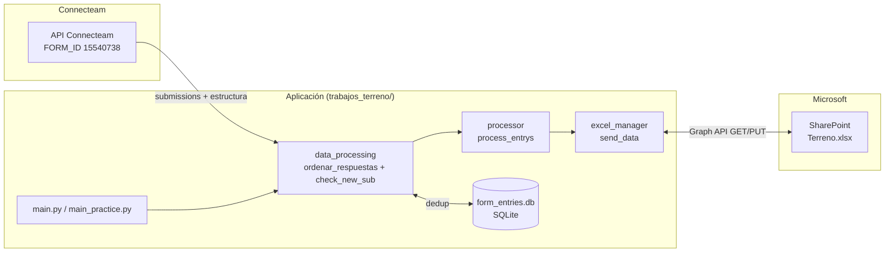

# 01 — Arquitectura

## 1. Propósito del sistema

El sistema sincroniza formularios de terreno rellenados por técnicos en la aplicación
Connecteam hacia un libro Excel en SharePoint (`Terreno.xlsx`). Ese libro es consumido
como modelo de datos por dashboards de Customer Experience. La aplicación se ejecuta de
forma desatendida y procesa únicamente las órdenes de trabajo (OT) que no han sido
enviadas previamente.

## 2. Componentes

| Componente | Archivo | Responsabilidad |
| --- | --- | --- |
| Orquestador automático | `trabajos_terreno/main.py` | Punto de entrada del job desatendido. |
| Orquestador interactivo | `trabajos_terreno/main_practice.py` | Reprocesamiento manual de OT específicas. |
| Configuración | `trabajos_terreno/config.py` | Carga de variables de entorno, constantes y URLs. |
| Cliente Connecteam | `trabajos_terreno/connecteam_api.py` | Llamadas REST a la API de Connecteam. |
| Aplanado de respuestas | `trabajos_terreno/data_processing.py` | Conversión del JSON anidado a DataFrame y deduplicación. |
| Normalizador | `trabajos_terreno/processor.py` | Descomposición de cada OT en registros atómicos. |
| Gestor de Excel | `trabajos_terreno/excel_manager.py` | Escritura incremental en las tablas de Excel. |
| Cliente SharePoint | `trabajos_terreno/sharepoint_client.py` | Fachada orientada a objetos sobre Graph API. |
| Cliente Graph | `trabajos_terreno/conn_sharepoint.py` | Autenticación MSAL y operaciones HTTP GET/PUT. |
| Persistencia | `trabajos_terreno/form_entries.db` | Registro SQLite de OT ya procesadas. |

## 3. Diagrama de alto nivel

## 4. Estilo arquitectónico

- **Pipeline batch lineal**: extracción → aplanado → deduplicación → normalización → carga.
  No hay estado intermedio persistente más allá del registro de deduplicación.
- **Idempotencia por deduplicación**: la base SQLite garantiza que una OT no se cargue
  dos veces en ejecuciones sucesivas del job automático. El modo interactivo, en cambio,
  no consulta la base y puede reenviar OT ya procesadas (uso deliberado para correcciones).
- **Acoplamiento a la nomenclatura del formulario**: la lógica de `processor.py` depende
  directamente de los títulos de pregunta y de la convención de prefijos numéricos de
  las columnas generadas por Connecteam. Un cambio en los títulos del formulario puede
  romper el procesamiento sin error de sintaxis.

## 5. Límites del sistema y supuestos

- El `FORM_ID` y la URL de destino (`EXCEL_URL`) están fijados en `config.py`.
- Se procesan como máximo las **últimas 100 submissions** por ejecución (límite del
  endpoint `all_submission`). OT más antiguas que no estén en esa ventana no se reprocesan
  aunque falten en el destino.
- La detección de puntos visitados usa el primer carácter del nombre de columna, lo que
  limita el sistema a **9 puntos por OT** (1–9).
- Todas las fechas se normalizan a la zona horaria `America/Santiago`.

## 6. Dependencias externas

| Servicio | Autenticación | Uso |
| --- | --- | --- |
| Connecteam API | Cabecera `X-API-KEY` | Estructura del formulario, submissions y resolución de usuarios. |
| Microsoft Graph | OAuth2 client credentials (MSAL) | Descarga y subida de `Terreno.xlsx`. |
| GitHub Actions | Secretos del repositorio | Orquestación y commit de la base de datos. |
