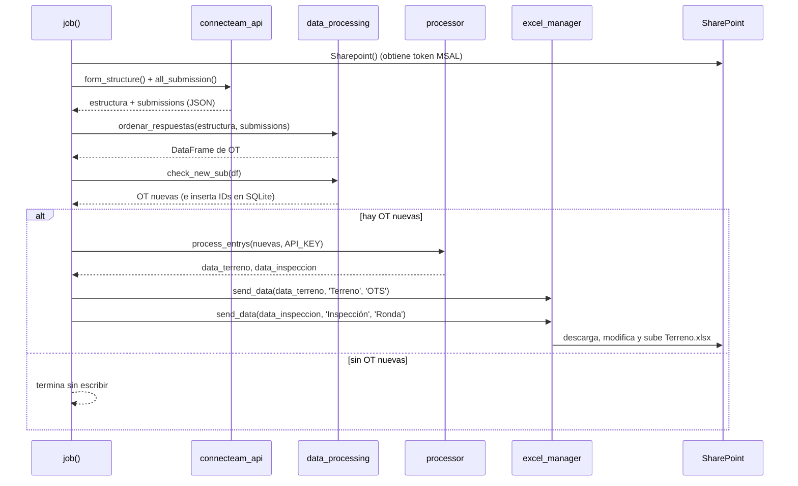
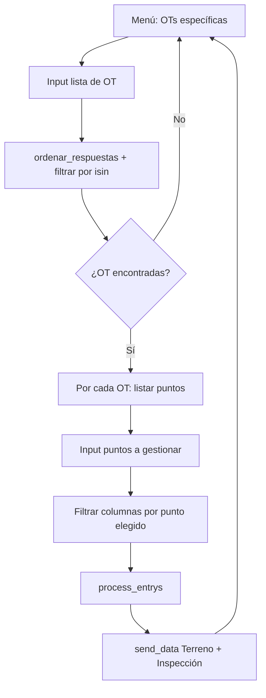

# 02 — Flujo del pipeline

Este documento describe el flujo de ejecución del job automático (`main.py` → `job()`) y
sus diferencias con el modo interactivo (`main_practice.py`).

## 1. Flujo automático (`job()`)

### Pasos detallados

1. **Inicialización de cliente** (`main.py:24`). Se instancia `Sharepoint()`, lo que
   dispara la adquisición del token de Microsoft Graph mediante client credentials.
2. **Extracción** (`main.py:28`). `form_structure` descarga la definición del formulario
   (mapa de `questionId` a título) y `all_submission` descarga las últimas 100 submissions.
3. **Aplanado** (`ordenar_respuestas`). El JSON anidado, incluyendo preguntas dentro de
   bloques `group`, se transforma en un DataFrame donde cada fila es una OT y cada columna
   es el título de una pregunta. La extracción de valores depende del `questionType`.
4. **Deduplicación** (`check_new_sub`). Se comparan los IDs de OT (`#`) contra la tabla
   `processed_entries` de `form_entries.db`. Solo se devuelven las OT nuevas, cuyos IDs
   se insertan inmediatamente en la base.
5. **Normalización** (`process_entrys`). Cada OT nueva se descompone en dos DataFrames:
   `data_terreno` (registros atómicos por equipo/punto/tipo de trabajo) y
   `data_inspeccion` (rondas de inspección expandidas por punto).
6. **Carga** (`send_data` → `modify_excel_file`). Se descarga `Terreno.xlsx`, se insertan
   las filas nuevas al inicio de la tabla nombrada correspondiente (`OTS` o `Ronda`),
   debajo del header y desplazando los datos previos hacia abajo, se actualiza la
   referencia de la tabla y se sube el archivo de vuelta.

### Manejo de errores

- Un fallo en la conexión a Connecteam (paso 2–3) se captura, se imprime y aborta el job
  con `return` sin tocar SharePoint (`main.py:29-32`).
- Un fallo durante el procesamiento o la carga se captura, se imprime el `traceback`
  completo y el job termina (`main.py:54-61`).
- **Consideración importante**: `check_new_sub` inserta los IDs en la base de datos
  **antes** de que la carga a SharePoint se confirme. Si la carga falla tras la inserción,
  esas OT quedarán marcadas como procesadas y no se reintentarán automáticamente; será
  necesario reenviarlas con el modo interactivo.

## 2. Flujo interactivo (`main_practice.py`)

El modo interactivo está pensado para corrección y reenvío manual. Diferencias respecto
al automático:

1. **No consulta la base de datos de deduplicación**. Toma la lista de OT que indica el
   operador por consola y filtra el DataFrame con `isin`.
2. **Selección de puntos por OT**. Para cada OT, lista los puntos disponibles (derivados
   del prefijo numérico de las columnas) y permite elegir cuáles gestionar; `Enter`
   procesa todos. Las columnas globales (sin prefijo numérico) siempre se conservan.
3. **Envío de ambos DataFrames**. La versión actual envía tanto `data_terreno` como
   `data_inspeccion` a SharePoint (`main_practice.py:109-110`).

## 3. Idempotencia y reprocesamiento

| Escenario | Comportamiento |
| --- | --- |
| Job automático, OT ya procesada | Se omite (no aparece en `check_new_sub`). |
| Job automático, OT nueva | Se procesa y su ID se inserta en SQLite. |
| Modo interactivo, cualquier OT en la ventana de 100 | Se reprocesa y reenvía, sin consultar SQLite. Puede generar duplicados en Excel si la OT ya fue cargada. |
| OT fuera de las últimas 100 submissions | No es accesible por ninguno de los dos modos. |
