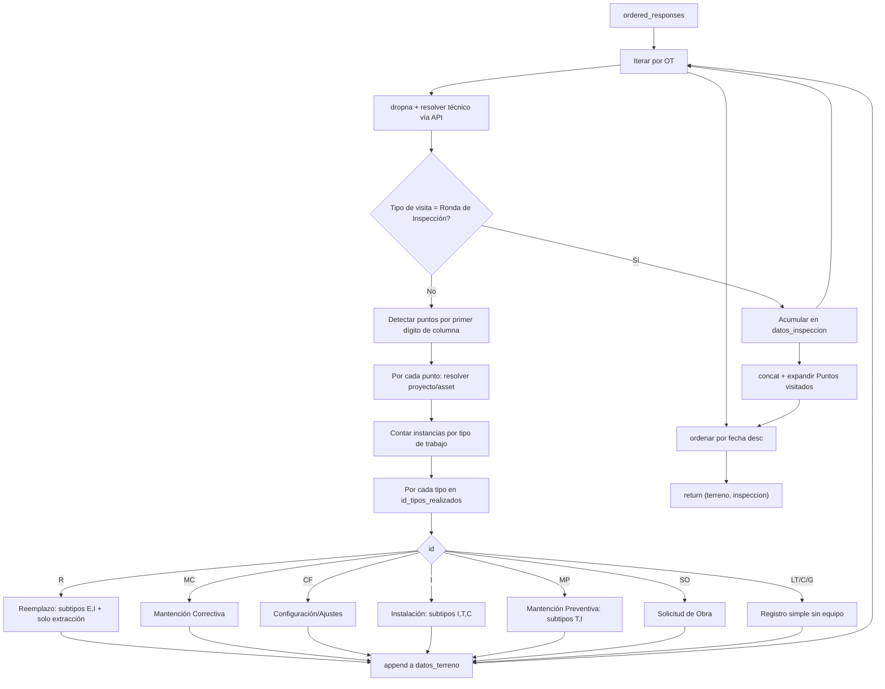

# 07 — Detalle técnico de `processor.py`

> Módulo: `trabajos_terreno/processor.py`
> Este documento reemplaza al antiguo `documentacion_processor.md` y describe el
> comportamiento **vigente** del código (verificado contra la fuente). Las secciones que en
> la versión anterior describían lógica de calibración `CI` y reclasificación automática
> han sido corregidas: esa lógica no está implementada en el código actual.

---

## 1. Propósito

`process_entrys` transforma el DataFrame de OT (salida de `ordenar_respuestas`) en dos
DataFrames:

| Salida | Descripción |
| --- | --- |
| `df_final_terreno` | Registros atómicos de trabajos de terreno, uno por equipo × punto × tipo de trabajo. |
| `df_final_inspeccion` | Rondas de inspección diarias, expandidas por punto visitado. |

## 2. Firma

```python
def process_entrys(ordered_responses: pd.DataFrame, API_key_c: str) -> tuple[pd.DataFrame, pd.DataFrame]
```

| Parámetro | Tipo | Descripción |
| --- | --- | --- |
| `ordered_responses` | `pd.DataFrame` | Una fila por OT; columnas dinámicas con títulos de pregunta. |
| `API_key_c` | `str` | API key de Connecteam, usada para resolver el ID de usuario a nombre. |

## 3. Flujo general



## 4. Preparación de cada OT

```python
r_clean = r.dropna()
df = r_clean.to_frame().T
```

`dropna` elimina las columnas nulas de esa fila, dejando solo las columnas pertinentes a la
OT (las columnas `1.*`, `2.*`, etc. de puntos no visitados desaparecen).

El ID del técnico se resuelve con `connecteam_api.user`; ante fallo se asigna
`"Usuario no encontrado"` y se imprime el traceback.

**Bifurcación**:

```python
if df['Tipo de visita realizada'].item() == '(R) Ronda diaria de Inspección':
    datos_inspeccion.append(df)
    continue
```

## 5. Catálogos internos

```python
id_tipo_de_trabajo = ['MP', 'MC', 'I', 'R', 'CF']

MP_type = ['T', 'I'];  MP_translate = {'I': 'Dispositivo', 'T': 'Tablero'}
R_type  = ['E', 'I']
I_type  = ['I', 'T', 'C'];  I_translate = {'I': 'dispositivo', 'T': 'tablero', 'C': 'Categoría'}

id_mantencion = {'MC': 'Mantención Correctiva', 'MP': 'Mantención Preventiva',
                 'I': 'Instalación', 'R': 'Reemplazo/Extracción', 'CF': 'Configuración/Ajustes'}
```

- `id_tipo_de_trabajo` se usa para construir `id_tipos_interes` (filtro informativo).
- `id_mantencion` y `operators` están definidos pero **no se usan** en la lógica de salida.

## 6. Detección de puntos visitados

```python
numeros_visita = set()
for col in df_columnas:
    if col and col[0].isdigit():
        numeros_visita.add(col[0])
numeros_visita = sorted(list(numeros_visita))
```

Se toma el **primer carácter** de cada nombre de columna. Limitación conocida: soporta como
máximo 9 puntos (1–9); un prefijo `10` colisionaría con `1`.

## 7. Construcción del DataFrame de visita

Para cada punto se seleccionan sus columnas (`startswith(i)`) y se anteponen las columnas
globales de la OT: `#`, `Contrato`, `Causa visita`, `user`, `Fecha visita `,
`Calidad del Servicio`, `Nombre del Cliente`, y los documentos de seguridad
`PT (Permiso de trabajo)`, `DET (Análisis de Riesgos)`,
`Cinco Pasos para Trabajar Seguro`, `Charla de 5 Minutos`,
`Check List de Camioneta/ Somnolencia`, `AST`.

### Resolución de proyecto y punto

- **Punto registrado**: el nombre incluye el proyecto entre corchetes
  (`"Estación Norte [Proyecto XYZ]"`). El proyecto se extrae con
  `re.search(r"\[([^\]]*)\]", ...)` y se elimina del nombre del punto.
- **Punto "No encontrado"**: se usa `{i} Proyecto` y el nombre ingresado en
  `{i}.1 Indicar nombre del punto`. Si la resolución falla, se asignan valores por defecto y
  el punto se omite con `continue`.

## 8. Conteo de instancias por tipo de trabajo

Se cuentan los prefijos únicos según el patrón de columna. Conteos calculados:

| Variable | Patrón buscado |
| --- | --- |
| `conteo_R['E']`, `conteo_R['I']` | ` R (E) \|`, ` R (I) \|` |
| `conteo_instancias_E` | ` E \|` (solo extracción) |
| `conteo_I['I']`, `conteo_I['T']`, `conteo_I['C']` | ` I (I) \|`, ` I (T) \|`, ` I (C) \|` |
| `conteo_MP['I']`, `conteo_MP['T']` | ` MP (I) \|`, ` MP (T) \|` |
| `conteo_instancias_MC` | ` MC \|` |
| `conteo_instancias_CF` | ` CF \|` |
| `conteo_instancias_CI` | ` CI \|` (se calcula, ver nota) |
| `conteo_instancias_SO` | ` SO \|` |

> Nota: `conteo_instancias_CI` se calcula pero **no se consume**: no existe una rama
> `elif id == 'CI'`, por lo que el tipo `CI` no produce registros en la salida.

## 9. Variables globales de la visita

```python
ot          = 'III-' + str(df_visita['#'][0])   # prefijo III- (pipeline de terreno)
proyecto, punto, contrato, fecha, tecnico, cliente, causa_visita
resolución  = df_visita[f'{i}.3 Resolución de visita'][0]
calidad, pt, det, cinco_pasos, charla, camioneta, ast
```

## 10. Procesamiento por tipo de trabajo

El bucle itera sobre `id_tipos_realizados` (los IDs declarados en
`{i}.2 Tipo de trabajo a realizar`).

### 10.1 `R` — Reemplazo / Extracción

Dos flujos:

1. **Reemplazo** (`for t in R_type` = `['E', 'I']`, por instancia de `conteo_R[t]`):
   extrae modelo, tipo (`Tipo equipo/instrumento a reemplazar`), serie, observación, motivo
   (`Motivo de reemplazo`) y `Destino` (solo cuando `t == 'E'`).

   > **Comportamiento real**: `Tipo de trabajo` se registra como el **subtipo** `t`, es
   > decir `'E'` o `'I'` (línea `trabajo_R = t`). **No** se emite el literal `'R'` ni hay
   > reclasificación a `CI`. Esta es la corrección principal respecto a la documentación
   > anterior.

2. **Solo extracción** (`for equipo in range(1, conteo_instancias_E+1)`): registros con
   `Tipo de trabajo = 'E'`, motivo `Motivo de extracción`.

### 10.2 `MC` — Mantención Correctiva

Itera sobre `conteo_instancias_MC`. Campos: `Modelo`, `Activo a intervenir`, `N° de serie`,
`Observación`. `Alcance = None`. El campo `¿Equipo operativo tras trabajos?` se lee pero no
se propaga a la salida.

### 10.3 `CF` — Configuración / Ajustes

Análogo a MC; `Alcance` se lee de `Tipo de Ajuste`.

### 10.4 `I` — Instalación

Doble iteración `for t in I_type` (`['I', 'T', 'C']`) × `conteo_I[t]`. Usa `.get(...)` para
tolerar campos ausentes en submissions antiguas y en el subtipo `C`.

- `Equipo` (`tipo_I`): para `t != 'C'` se lee `Tipo de {I_translate[t]}`; para `t == 'C'` se
  lee `{I_translate['C']}` (campo "Categoría").
- `Alcance`: `'IH | Habilitación de equipo'` para `t != 'T'`; para tableros (`t == 'T'`) se
  lee `Alcance de la intervención`.
- `operativo_I` se fija `False` para `t == 'C'` (no se propaga a la salida).

### 10.5 `MP` — Mantención Preventiva

Doble iteración `for t in MP_type` (`['T', 'I']`) × `conteo_MP[t]`. Etiquetas adaptadas con
`MP_translate` (`Tablero a intervenir` / `Dispositivo a intervenir`). `Alcance = None`.

### 10.6 `SO` — Solicitud de Obra

Itera sobre `conteo_instancias_SO`. `Alcance = Tipo de solicitud`, `Observación` poblada;
`Equipo`, `Modelo`, `N° serie` quedan `None`.

### 10.7 `LT`, `C`, `G` — Registros simples

Generan un registro por tipo con todos los campos de equipo (`Equipo`, `Modelo`,
`N° serie`, `Alcance`, `Observación`) en `None`.

## 11. Estructura del registro de salida

```python
{
  'OT', 'Técnico', 'Contrato', 'Causa visita', 'Proyecto', 'Asset',
  'Tipo de trabajo',          # 'E' | 'I' | 'MC' | 'CF' | 'MP' | 'SO' | 'LT' | 'C' | 'G'
  'Fecha visita', 'Cliente', 'Resolución visita', 'Calidad del Servicio',
  'PT (Permiso de trabajo)', 'DET (Análisis de Riesgos)',
  'Cinco Pasos para Trabajar Seguro', 'Charla de 5 Minutos',
  'Check List de Camioneta/ Somnolencia', 'AST',
  'Observación', 'Equipo', 'Modelo', 'N° serie', 'Alcance'
}
```

> Los valores posibles de `Tipo de trabajo` provienen del subtipo en reemplazos (`E`/`I`) o
> del propio `id` en el resto. El literal `R` y el tipo `CI` no aparecen en la salida actual.

## 12. Post-procesamiento de inspecciones

```python
df_final_inspeccion = pd.concat(datos_inspeccion, ignore_index=True)
```

- **Expansión por puntos visitados**: si `Puntos visitados` contiene varios puntos separados
  por coma, la fila se replica una vez por punto.
- **Eliminación de columna**: se elimina `Fotos ` (con espacio final).
- **Ordenamiento**: ambos DataFrames se ordenan por fecha descendente (`Fecha visita` en
  terreno, `Fecha visita ` en inspección).

## 13. Dependencias del módulo

| Módulo | Uso |
| --- | --- |
| `re` | Extracción del proyecto desde `[...]`. |
| `pandas` | Manipulación de DataFrames. |
| `connecteam_api.user` | Resolución de ID de usuario a nombre. |
| `base64`, `numpy`, `datetime`, `traceback` | Importados; `traceback` se usa en el manejo de errores, los demás no se utilizan en la lógica actual. |

## 14. Limitaciones conocidas

1. **Máximo 9 puntos por OT** por usar `col[0]`.
2. **`Tipo de trabajo` de reemplazos** se registra como subtipo (`E`/`I`), no como `R`.
3. **Tipo `CI` no materializado**: el conteo existe pero no hay rama que genere registros.
4. **Campo `operativo` no propagado** en MC, CF, I y MP.
5. **`operators` e `id_mantencion`** definidos sin uso.
6. **Resolución de punto "No encontrado"** que falla omite el punto silenciosamente (`continue`).
7. **Columnas con espacio final** (`Fecha visita `, `Fotos `) requieren referencia exacta.
8. **Filtro `columnas_trabajo`** usa coincidencia de subcadena (`f'{id}' in columna or "E" in columna`), sensible a colisiones de letras en nombres de columna.
